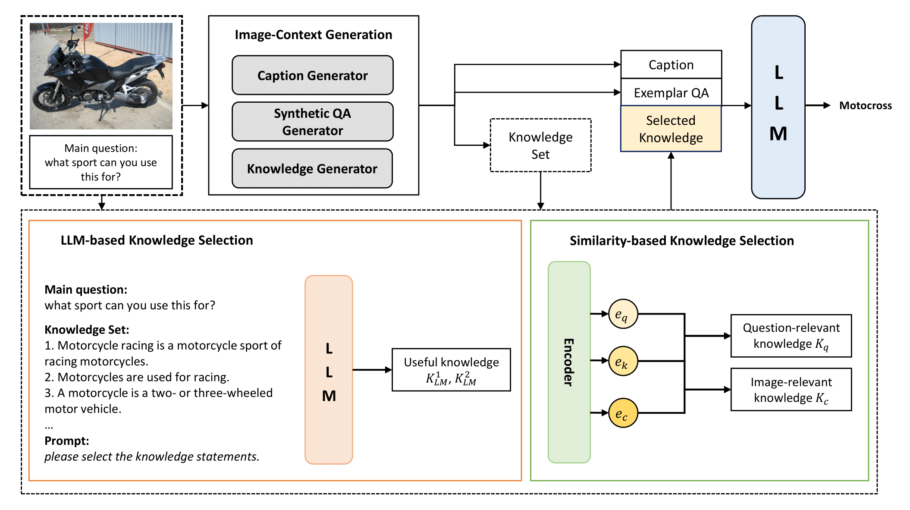

# Diverse Knowledge Selection for Enhanced Zero-shot Visual Question Answering


<!-- <p align="center">
  
</p> -->


## Requirements
- python 3.10
- pytorch 2.2.2
- transformers 4.44

Build on CUDA 12.3


To run this code, download `annotations_trainval2014.zip` from [here](https://cocodataset.org/#download) and extract in `./annotation_new/`

## Run

### OKVQA
```shell
bash run_okvqa.sh
```

### A-OKVQA
```shell
bash run_aokvqa.sh
```